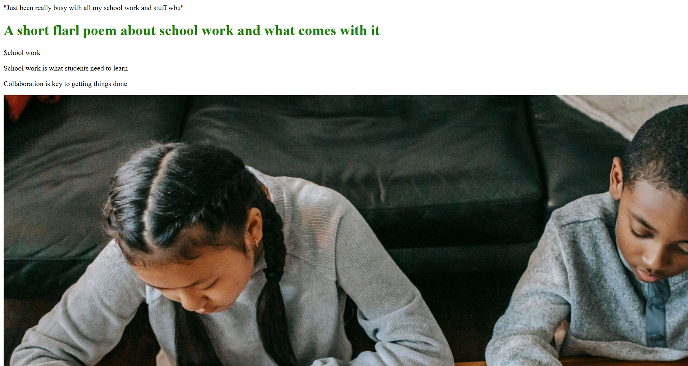
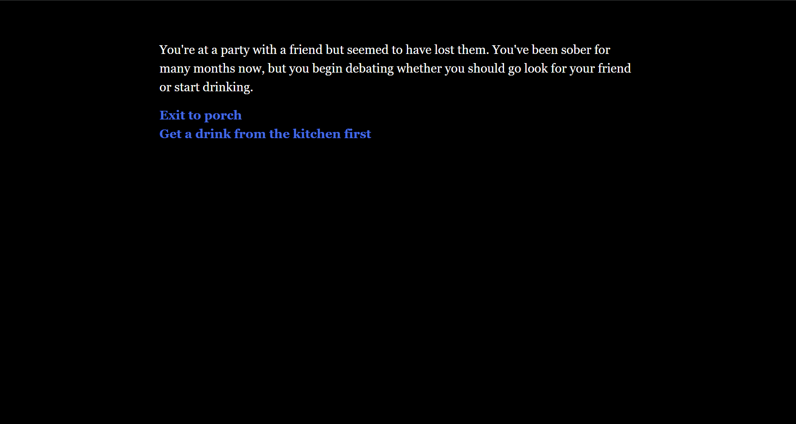

<head>
"Just been really busy with all my school work and stuff wbu"
<link href="style.css" rel="stylesheet" />
</head>

<body>
<h1>A short flarl poem about school work and what comes with it</h1>

 
  School work 

  School work is what students need to learn  
  Collaboration is key to getting things done 
  

  School work is very tiring and causes students to sleep 
  Why won't the school work ever end? 
  All I could think about is catching some Z's 
  
    

  School work is challenging and students often need help 
  Everything is always better when done with others 

  
  

  School work can be very fullfilling after being completed 
  Oh wait... It never truly ends.

  
  
</body>
